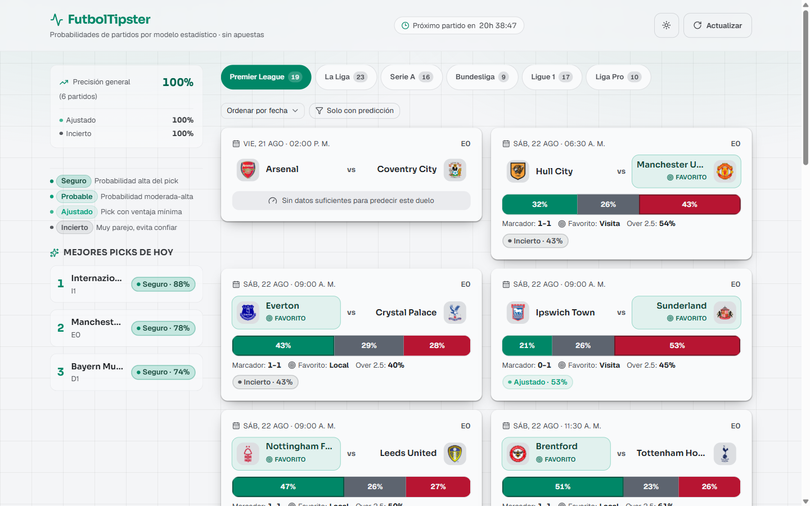
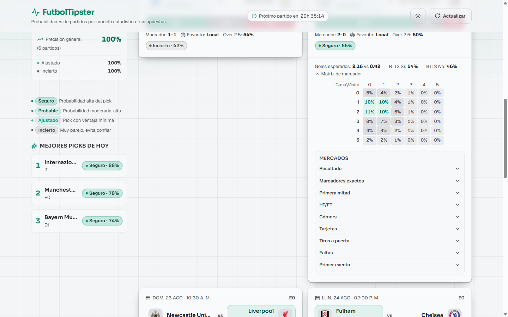

# FutbolTipster

Statistical football predictions (1X2 and derived markets) powered by Dixon-Coles and Negative-Binomial models, presented with confidence bands. **Informative, not betting advice.**



## What it is

A full-stack project that predicts football match outcomes from a statistical engine and shows them in a responsive web app:

- **6 leagues**: 5 European (Premier League, La Liga, Serie A, Bundesliga, Ligue 1) + the Ecuadorian Liga Pro (EC1)
- **~20 derived markets** per match: double chance, over/under, Asian handicap, HT and HT/FT, corners, bookings, shots on target, fouls, first goal/corner
- **Confidence bands** on every prediction (Safe, Likely, Tight, Uncertain) so you know how much to trust each pick
- **Two model families**: Dixon-Coles (bivariate Poisson for full-time and first-half scores) and Negative-Binomial for count markets, trained on 2014–2025 results with temporal decay and recent form (k=5)



## How it works

```
ESPN (live fixtures)  →  server (Node/Express + SQLite)  →  ml-service (FastAPI models)  →  web (React)
```

The server syncs fixtures from ESPN on a cron schedule, resolves team names against the models, asks the ml-service for predictions, and persists everything in SQLite. The web app reads from `/api` — nothing else.

## Tech stack

| Service | Stack | Role |
|---------|-------|------|
| `ml-service` | Python / FastAPI | Statistical models and markets (`/predict`, `/teams`, `/health`) |
| `server` | Node / Express + SQLite | ESPN orchestration, team resolution, predictions, tracking |
| `web` | React 19 / Vite / Tailwind v4 | Responsive SPA that only reads `/api` |

## Getting started

```bash
# ml-service (models)
cd ml-service
pip install -r requirements.lock
uvicorn app.api:app --port 8001

# server (Express + SQLite + ESPN)
cd server
cp ../.env.example .env
npm install && npm run dev

# web (frontend)
cd web
npm install && npm run dev   # http://localhost:5173
```

Environment variables are documented in `.env.example`; API endpoints and the data/training pipeline are documented in the source of each service (`server/`, `ml-service/`, `web/`).

## Validation & honesty

Models are validated walk-forward on out-of-sample seasons (2023–2025, n≈5.4k): log-loss ≈ 0.99, RPS ≈ 0.20, ~52% accuracy for the FT model. A flat-betting backtest of all 14 markets with synthetic SBOBET-style odds shows **no market beats the 7% bookmaker margin** — derived markets are informative, not a betting system.

## Roadmap

- **Band-level recalibration** (deferred): only if the project is monetized.
- **Player-level markets** (deferred): needs a scorer-per-match data source.

## License

MIT — see [LICENSE](LICENSE).

## Author

Pablo Domínguez — [GitHub](https://github.com/Pa004) · [LinkedIn](https://www.linkedin.com/in/pabl004-dev)